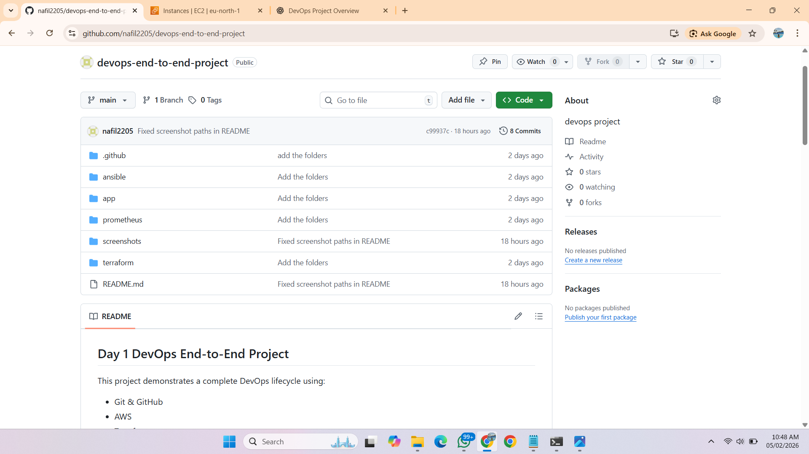
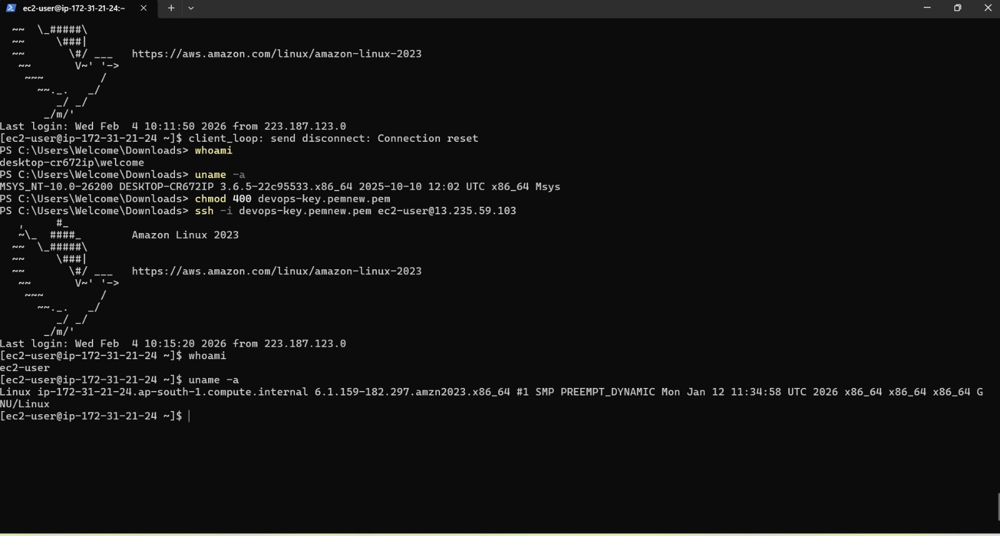

# DevOps End-to-End Project

## Project Overview

This repository showcases a complete, production-aligned DevOps lifecycle implemented using industry-standard tools and practices. The project is built incrementally, with each phase focusing on a specific layer of the DevOps workflow—from source control and infrastructure provisioning to configuration management, containerization, CI/CD, and monitoring.

The approach emphasizes clean repository structure, secure cloud practices, and validation at every stage, reflecting how DevOps solutions are implemented and maintained in real-world environments.

---

## Technology Stack

* **Version Control:** Git & GitHub
* **Cloud Platform:** AWS
* **Infrastructure as Code:** Terraform
* **Configuration Management:** Ansible
* **Containerization:** Docker
* **CI/CD:** Jenkins / GitHub Actions (planned)
* **Monitoring & Observability:** Prometheus & Grafana

---

## Day 1 – Git, GitHub & Project Foundation

### Objective

Establish a solid project foundation using Git and GitHub, with a clean repository structure suitable for scaling DevOps workflows.

---

### Git Installation & Configuration

* Installed Git on the local system and verified the installation.
* Configured global username and email to ensure proper commit attribution and traceability.

```bash
git --version
git config --global user.name "<username>"
git config --global user.email "<email>"
```

---

### GitHub Repository Setup

* Logged into GitHub and created a dedicated repository for the DevOps project.
* Established the connection between the local repository and GitHub.
* Followed standard GitHub practices for managing repositories, commits, and branches.

---

### Project Structure Initialization

* Initialized Git within the local project directory.
* Designed a structured directory layout aligned with DevOps tooling and automation stages.
* Ensured the repository was clean, readable, and easy to extend in later phases.

```bash
git init
```

---

### First Commit & Version Control Practices

* Verified repository status before committing changes.
* Performed the initial commit and pushed it to the remote repository.
* Practiced essential Git commands used in day-to-day DevOps workflows.

```bash
git status
git clone
git pull
git push
git log
```




---

### Troubleshooting & Lessons Learned

* Git does not track empty directories by default.
* Empty folders were not visible on GitHub until a `.gitkeep` file was added.
* Ensured all work was performed inside the directory containing the `.git` folder.
* Validated file tracking and repository context using `git status`, `ls -a`, and `pwd`.

These checks reinforced correct repository structure and version control best practices commonly followed in team environments.

---

## Day 2 – AWS EC2 and Apache Web Server Setup

### Objective

Provision an EC2 instance on AWS and deploy an Apache web server to validate compute resources, networking, and basic server configuration.

---

### EC2 Instance Provisioning

* Launched an EC2 instance using **Amazon Linux** with a **t3.micro** instance type.
* Created a key pair for secure SSH-based access.
* Configured a security group with the following inbound rules:

  * SSH (port 22)
  * HTTP (port 80)
  * Custom TCP (port 3000)
  * Custom TCP (port 9090)

This configuration supports both web access and future integrations such as CI/CD pipelines and monitoring tools.


---

### SSH Connectivity Validation

* Accessed the EC2 instance securely using SSH and the PEM key file.
* Successful login confirmed correct subnet routing, internet gateway configuration, and security group rules.


---

### Apache Web Server Installation

* Installed Apache HTTP Server on the EC2 instance.
* Started the service and enabled it to launch automatically on system startup.

```bash
sudo yum install httpd -y
sudo systemctl start httpd
sudo systemctl enable httpd
```

---

### Service & Port Validation

* Verified the Apache service status.
* Confirmed that the server was actively listening on port 80.

```bash
sudo systemctl status httpd
sudo netstat -tulnp | grep 80
```




---

### Web Access Verification

* Accessed the Apache default test page using the EC2 public IP address via a web browser.
* This validated end-to-end connectivity across the compute, networking, and application layers.


---

## Project Status

The base infrastructure and web layer are stable and ready for the next phases, including infrastructure automation, configuration management, containerization, and CI/CD integration.
