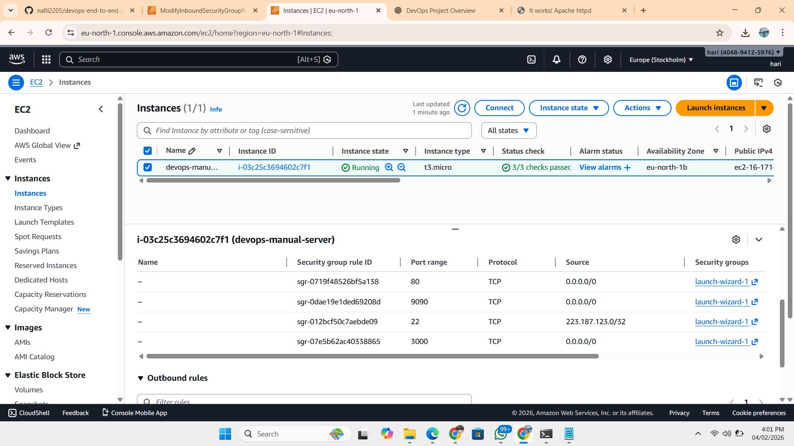

## DevOps End-to-End Project
This project demonstrates a complete DevOps lifecycle using:

Git & GitHub
AWS
Terraform
Ansible
Docker
CI/CD
Prometheus & Grafana
This repository will be built step by step.

## Troubleshooting & Lessons Learned

- Git does not track empty directories by default.
- Empty project folders were not visible on GitHub until a .gitkeep file was added.
- Ensured all work was done inside the Git repository directory containing the .git folder.
- Verified file tracking using git status, ls -a, and pwd.

This helped reinforce proper Git repository structure and version control best practices.

## Day 1 – Git, GitHub & Project Foundation
Objective
Learn Git fundamentals, set up GitHub, and create a structured DevOps project repository.

1. Git Installation & Verification
Installed Git on local system
Verified installation: bash git --version
git config --global user.name "Your Name" git config --global user.email "your-email@example.com"

2. Git Configuration
Configured global Git username and email to track commits: bash git config --global user.name "Your Name" git config --global user.email "your-email@example.com"

3. GitHub Setup
Logged into GitHub account
Created a new repository for the DevOps project
Understood core GitHub concepts:
Repositories for source code management
Commits to track changes
Branches for feature and version control
Learned how GitHub integrates with Git for version control and collaboration

4. Project Repository Creation
Created a new repository on GitHub
Initialized Git in the local project directory: bash git init

5. Project Structure Setup
Created a structured directory layout to support DevOps tools and workflows
Organized folders based on tool usage and automation stages:

6. First Commit & Push
Checked the current status of the repository: bash git status

7. Git Basics Practiced
Practiced essential Git commands: bash git clone # Clone a remote repository git pull # Fetch and merge changes from remote git push # Push local commits to remote git log # View commit history
Troubleshooting & Lessons Learned
Git does not track empty directories by default.
Empty project folders were not visible on GitHub until a .gitkeep file was added.
Ensured all work was done inside the Git repository directory containing the .git folder.
Verified file tracking using git status, ls -a, and pwd.
This helped reinforce proper Git repository structure and version control best practices.

## Day 2 – AWS EC2 and Apache Web Server Setup
Objective
Launch an EC2 instance on AWS and deploy an Apache web server.

Web Access Verification
The Apache default test page was accessed successfully using the EC2 public IP address through a web browser.validate compute, networking, and basic server configuration.

## EC2 Instance Setup
An EC2 instance was launched using Amazon Linux with a t3.micro instance type. A key pair was created for secure SSH access, and a security group was configured to allow SSH (port 22) and HTTP (port 80) traffic Custom Tcp (port 3000) and Custom TCP (Port 9090).

## SSH Access
The EC2 instance was accessed securely using SSH and a PEM key file, confirming successful connectivity to the server.

Apache Web Server Installation
Apache HTTP Server was installed, started, and enabled to run on system startup.

bash sudo yum install httpd -y sudo systemctl start httpd sudo systemctl enable httpd

Service Validation
The Apache service status was verified, and it was confirmed that the server was listening on port 80.

bash sudo systemctl status httpd sudo netstat -tulnp | grep 80

Web Access Verification
The Apache default test page was accessed successfully using the EC2 public IP address through a web browser.

